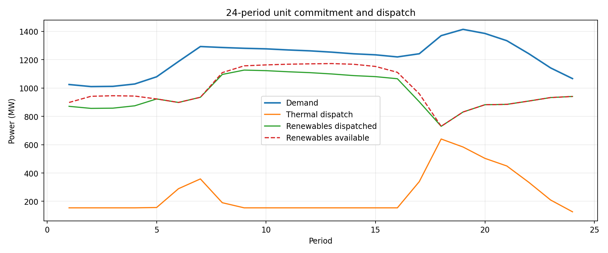
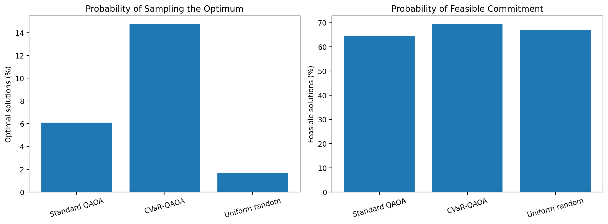

# Hybrid Quantum–Classical Grid Optimisation Using QAOA

### Renewable-Aware Unit Commitment and Power Dispatch

This project investigates a hybrid quantum–classical approach to **unit commitment**: deciding which electricity generators should operate, when they should start or shut down, and how much power they should produce to satisfy electricity demand at minimum operating cost.

Using the **PGLib-UC RTS-GMLC** benchmark, we combine classical optimisation with **Quantum Approximate Optimization Algorithm (QAOA)** and **Conditional Value at Risk QAOA (CVaR-QAOA)** implemented in Qiskit.

The project progresses from a six-qubit, single-period demonstration to a **24-period renewable-aware scheduling model**, together with a **12-qubit quantum experiment** on a smaller time-dependent subproblem.

> **Scope:** We evaluate quantum optimisation methods against classical baselines. We **do not claim computational quantum advantage**.

---

## 1. Problem Statement

Electricity grids must continuously balance generation and consumption. Wind and solar availability changes over time, while thermal generators have operational constraints:

- Minimum and maximum generation capacity
- Production and startup costs
- Ramp-up and ramp-down limits
- Minimum ON/OFF durations
- Spinning reserve requirements

Our classical scheduling objective is to minimise total operating and startup costs:

```math
\min \sum_t \sum_i \left[C_i(P_{i,t}) + S_i u_{i,t}\right]
```

subject to power balance, reserve requirements, generator operating limits, and applicable time-linked scheduling constraints.

Here, $P_{i,t}$ is generator $i$'s power output at time $t$, $C_i$ is its production-cost function, $S_i$ is its startup cost, and $u_{i,t}$ indicates a startup event.

The model combines **binary commitment variables** and **continuous generation decisions**, making unit commitment a mixed-integer optimisation problem.

## 2. Dataset

We use the [PGLib-UC benchmark library](https://github.com/power-grid-lib/pglib-uc), specifically the [RTS-GMLC instance for 2020-01-27](https://github.com/power-grid-lib/pglib-uc/blob/master/rts_gmlc/2020-01-27.json).

| Component | Description |
|---|---|
| Thermal generators | 73 |
| Renewable generators | 81 |
| Scheduling periods | 48 |
| Demand and reserves | Time-dependent requirements |
| Generator parameters | Capacities, cost curves, ramp limits and operating constraints |

We construct smaller benchmark-derived scenarios by selecting subsets of generators and scaling demand and reserves according to the selected thermal capacity. Renewable availability profiles are retained for the selected units.

These are **constructed test scenarios**, not geographically or electrically equivalent miniature versions of the original transmission grid.

## 3. Methodology

### Experiment A — Single-Period Unit Commitment

The first experiment uses **six thermal generators, one wind generator and one solar generator**, for one selected scheduling period. Six binary commitment variables yield:

```math
2^6 = 64 \text{ possible ON/OFF configurations.}
```

**Classical baseline.** For each commitment, SciPy's linear programming solver performs continuous economic dispatch. The least expensive feasible configuration is the exact optimum of the **simplified single-period model**. This experiment does not enforce time-linked ramping or minimum ON/OFF durations.

**Quantum optimisation.** We construct a six-variable QUBO using approximate generator costs and a quadratic capacity-adequacy penalty. The QUBO is converted into an Ising Hamiltonian and optimised with Qiskit using:

- Standard QAOA, which minimises expected QUBO energy
- CVaR-QAOA, which minimises the mean energy of the lowest-energy 20% of probability mass
- Uniform random sampling, as a sampling baseline

The QUBO is a **surrogate objective**: we evaluate commitment feasibility and actual operating cost separately using the classical dispatch solver.

### Experiment B — Multi-Period Classical Scheduling

The second experiment includes **20 thermal generators**, **seven renewable generators**, and **24 consecutive time periods**.

We solve a mixed-integer linear program (MILP) using SciPy's HiGHS optimiser, accounting for:

- Generator commitment, startup and shutdown decisions
- Continuous thermal and renewable dispatch
- Piecewise-linear thermal production costs
- Power balance and thermal reserve requirements
- Ramp limits and minimum ON/OFF times

The resulting schedules, operational metrics and generation plot are saved in `results/multi_period/`.



### Experiment C — Time-Dependent QAOA

Directly simulating a QAOA circuit over the full 20-generator, 24-period commitment schedule is impractical on a conventional computer.

Instead, we select **four thermal generators over periods 16–18**, while fixing the other thermal generators to their schedules from the classical MILP solution. The conditional subproblem uses:

```math
4 \times 3 = 12 \text{ binary commitment variables (12 qubits).}
```

Its QUBO includes approximate operating costs, generator startup transitions between consecutive periods, and capacity-adequacy penalties inspired by slack-free unbalanced penalisation.

Every candidate schedule is checked by a separate classical economic-dispatch feasibility calculation. We enumerate all:

```math
2^{12} = 4096 \text{ possible commitment schedules}
```

to determine the exact classical optimum **for this conditional three-period subproblem**. It is not the same objective as the full 24-period MILP.

## 4. Qiskit Implementation

We implement QAOA circuits directly in Qiskit, rather than calling a prebuilt QAOA optimiser.

1. Convert binary variables into Pauli-Z operators using $x_i=(1-Z_i)/2$.
2. Prepare an initial uniform superposition with Hadamard gates.
3. Apply parameterised `RZ` and `RZZ` gates for the cost Hamiltonian.
4. Apply `RX` gates for the mixing Hamiltonian.
5. Optimise QAOA parameters with classical COBYLA.
6. Use statevector simulation for training and Qiskit Aer for finite-shot measurements.

Standard QAOA and CVaR-QAOA use the same circuit structure but different classical training objectives. **All experiments use ideal quantum simulators, not physical quantum hardware.**

## 5. Experimental Results

### 5.1 Single-Period Results

The exact classical optimum is commitment **`011001`**, with an operating cost of **4,278.46 benchmark cost units**.

Measured results from **4,096 shots per method**:

| Method | Optimal commitment sampled | Physically feasible samples |
|---|---:|---:|
| Standard QAOA | 6.10% | 64.50% |
| CVaR-QAOA | 14.75% | 69.36% |
| Uniform random | 1.71% | 67.09% |

All three methods sampled the classical optimum at least once, so the **best-found optimality gap was 0%** for all three.



CVaR-QAOA concentrated more probability on the optimal commitment in this run. However, the original training settings used different optimiser budgets; later matched-settings runs still differed in actual function evaluations. These results do not establish that CVaR-QAOA is universally superior.

### 5.2 Multi-Period Classical Results

| Metric | Result |
|---|---:|
| Thermal generators | 20 |
| Renewable generators | 7 |
| Scheduling periods | 24 |
| MILP variables | 3,528 |
| Binary variables | 1,440 |
| Constraints | 3,888 |
| Total operating cost | **166,249.36** |
| Total renewable curtailment | **795.71 MW-periods** |
| Reported MILP optimality gap | **0.0606%** |
| Observed solver time (one run) | 4.05 seconds |

The solver returned a feasible multi-period schedule. The reported MIP gap indicates termination within the chosen solver tolerance, **not a certified zero-gap optimum**.

### 5.3 Twelve-Qubit Temporal QAOA Results

| Metric | Result |
|---|---:|
| Qubits | 12 |
| QAOA layers | 1 |
| Candidate commitment schedules | 4,096 |
| Physically feasible schedules | 10 |
| Exact classical optimum of conditional subproblem | **40,103.16** |
| Physical operating cost of QUBO optimum | **41,342.09** |
| QUBO optimum's physical-cost gap | **3.09%** |

Measured results from **4,096 shots per method**:

| Metric | Standard QAOA | CVaR-QAOA |
|---|---:|---:|
| Feasible-schedule sampling rate | 9.69% | 13.01% |
| Physically optimal schedule sampled | 1.07% | 2.44% |
| Best sampled physical cost | 40,103.16 | 40,103.16 |
| COBYLA function evaluations | 148 | 175 |
| Circuit depth (untranspiled) | 15 | 15 |

Only 10 of 4,096 possible schedules were physically feasible, giving a **uniform-random feasibility probability of approximately 0.244%**. Both QAOA variants sampled the physical optimum in the finite-shot run.

**QUBO approximation matters:** The exact QUBO optimum cost 3.09% more than the exact physical optimum after dispatch validation. In this experiment, CVaR-QAOA's most likely bitstring happened to be the physically optimal schedule, although it was not the QUBO-energy minimum. This observation is instance-specific.

## 6. Repository Structure

```text
data/
    2020-01-27.json
    reduced_instance.json
    multi_period_instance.json

notebooks/
    01_data_exploration.ipynb
    02_multi_period_exploration.ipynb

src/
    multi_period_milp.py
    temporal_qaoa.py

results/
    classical_best.json
    classical_results.csv
    quantum_benchmark.csv
    controlled_comparison.csv
    measurement_counts.json
    qaoa_comparison.png
    cvar_distribution.png
    multi_period/
        period_summary.csv
        thermal_schedule.csv
        renewable_schedule.csv
        solver_summary.json
        dispatch_plot.png
    temporal_quantum/
        classical_enumeration.csv
        quantum_results.csv
        standard_counts.json
        cvar_counts.json
        summary.json

README.md
SUBMISSION.md
requirements.txt
.gitignore
```

## 7. Installation and Reproduction

### Requirements

Python, NumPy, Pandas, SciPy, Matplotlib, Qiskit, Qiskit Aer, and Jupyter (or VS Code with Jupyter support).

Install dependencies from the repository root:

```bash
python -m pip install -r requirements.txt
```

### Running the notebooks

- `notebooks/01_data_exploration.ipynb` — Original dataset exploration, single-period classical optimisation, six-qubit QAOA and results.
- `notebooks/02_multi_period_exploration.ipynb` — Dataset exploration, creation of the multi-period instance and execution of the two Python scripts.

### Running the implementations

First create `data/multi_period_instance.json` using the second notebook. Then execute, **in this order**, from the repository root:

```bash
python src/multi_period_milp.py
python src/temporal_qaoa.py
```

Alternatively, from within the second notebook:

```python
%run ../src/multi_period_milp.py
%run ../src/temporal_qaoa.py
```

The temporal quantum experiment requires the classical MILP's saved `results/multi_period/thermal_schedule.csv`. Scripts write their outputs beneath `results/`.

## 8. Limitations and Future Work

- **No demonstrated quantum speedup:** Classical MILP and exhaustive enumeration remain effective at the tested sizes.
- **Approximate quantum objective:** The QUBO does not encode the complete physical dispatch model or every operating constraint.
- **Conditional quantum subproblem:** The 12-qubit experiment optimises four generators over three periods while other thermal commitments and outputs are fixed.
- **Reduced system representation:** We enforce aggregate power balance, not transmission-network power-flow constraints.
- **Simplified startup costs:** The multi-period model uses a single startup-cost tier rather than modelling all downtime-dependent cost categories.
- **Known renewable availability:** We do not model forecast uncertainty.
- **Ideal simulation only:** We do not evaluate noise or demonstrate execution on quantum hardware.

Potential extensions include better constraint-preserving QUBO formulations, noise-aware QAOA, larger conditional problems, and rolling-horizon quantum–classical scheduling.

## 9. Research References

1. **PGLib-UC Benchmark Library**, IEEE PES Task Force on Benchmarks for Validation of Emerging Power System Algorithms. [GitHub](https://github.com/power-grid-lib/pglib-uc).
2. **Koretsky et al. (2021)**, *Adapting Quantum Approximation Optimization Algorithm (QAOA) for Unit Commitment*, IEEE International Conference on Quantum Computing and Engineering. [DOI](https://doi.org/10.1109/QCE52317.2021.00035).
3. **Moncayo-Martínez and He (2026)**, *Quantum optimisation for supply chain: QUBO formulations and QAOA solutions for facility location and load balancing*, *Results in Engineering*. [DOI](https://doi.org/10.1016/j.rineng.2025.108373).
4. **Barkoutsos et al. (2020)**, *Improving Variational Quantum Optimization using CVaR*, *Quantum* 4, 256. [DOI](https://doi.org/10.22331/q-2020-04-20-256).

---

**Summary:** A reproducible hybrid quantum–classical investigation of renewable-aware unit commitment, combining multi-period MILP scheduling, Qiskit QAOA, classical feasibility verification and transparent benchmarking—without claiming quantum computational advantage.
